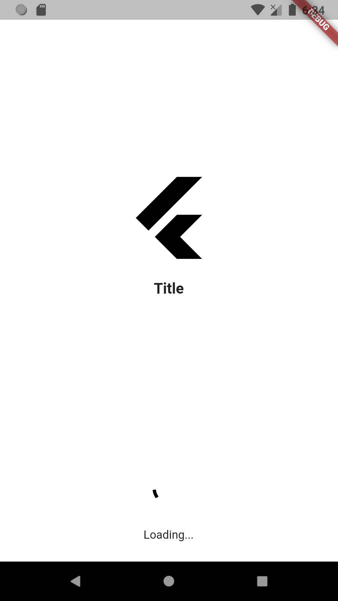

# [Custom Splash Screen](https://pub.dev/packages/splashscreen)

* A easy_splash_screen is a flutter package for easily implement the splash screen in the app


## Screenshots



## Usage

To use this package :

* add the dependency to your pubspec.yaml file.

```yaml
  dependencies:
    flutter:
      sdk: flutter
    easy_splash_screen:
```

### How to use

As time based...

``` dart
import 'package:easy_splash_screen/custom_splashscreen.dart';
import '../home.dart';
import 'package:flutter/material.dart';

class SplashPage extends StatefulWidget {
  SplashPage({Key? key}) : super(key: key);

  @override
  _SplashPageState createState() => _SplashPageState();
}

class _SplashPageState extends State<SplashPage> {
  @override
  Widget build(BuildContext context) {
    return easy_splash_screen(
      logo: Image.network(
          'https://cdn4.iconfinder.com/data/icons/logos-brands-5/24/flutter-512.png'),
      title: Text(
        "Title",
        style: TextStyle(
          fontSize: 18,
          fontWeight: FontWeight.bold,
        ),
      ),
      backgroundColor: Colors.grey.shade400,
      showLoader: true,
      loadingText: Text("Loading..."),
      navigator: HomePage(),
      durationInSeconds: 5,
    );
  }
}

```

As future based...

``` dart
import 'dart:async';

import 'package:easy_splash_screen/custom_splashscreen.dart';
import '../home.dart';
import 'package:flutter/material.dart';

class SplashFuturePage extends StatefulWidget {
  SplashFuturePage({Key? key}) : super(key: key);

  @override
  _SplashFuturePageState createState() => _SplashFuturePageState();
}

class _SplashFuturePageState extends State<SplashFuturePage> {
  Future<Widget> futureCall() async {
    // do async operation ( api call, auto login)
    return Future.value(new HomePage());
  }

  @override
  Widget build(BuildContext context) {
    return easy_splash_screen(
      logo: Image.network(
          'https://cdn4.iconfinder.com/data/icons/logos-brands-5/24/flutter-512.png'),
      title: Text(
        "Title",
        style: TextStyle(
          fontSize: 18,
          fontWeight: FontWeight.bold,
        ),
      ),
      backgroundColor: Colors.grey.shade400,
      showLoader: true,
      loadingText: Text("Loading..."),
      futureNavigator: futureCall(),
    );
  }
}
```
